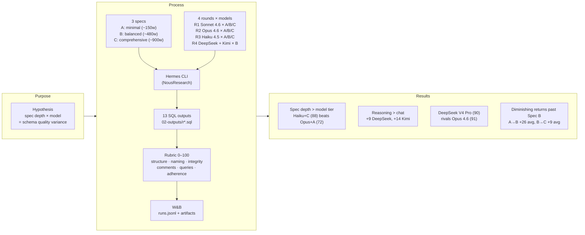

# hermes-exploratory

Bounded experiment to validate **context engineering** with **Hermes** (LLM orchestrator, [NousResearch/hermes-agent](https://github.com/NousResearch/hermes-agent)) and **W&B / wandb** (run observability) before applying the methodology to JikkoOps.

> See [METHODOLOGY.md](./METHODOLOGY.md) for the rationale (why this experiment, what we measure, what ships back to JikkoOps).

## Phases

This repo holds two separate exercises, kept in distinct folders:

- **Phase 1 — exploratory (this README, `01-specs/` … `04-skills/`)**: manual sweep
  of spec depth × model to find the SQL-quality sweet spot. Complete; left as-is.
- **Phase 2 — automated gate ([`phase-2/`](./phase-2/README.md))**: turns the Phase 1
  finding into a GitHub Actions gate. A spec PR is auto-scored by two models; merge
  is blocked until mean precision ≥ 0.85. Implements the 7-step CI flow — see
  [`phase-2/ARCHITECTURE.md`](./phase-2/ARCHITECTURE.md) for the step→file map.

## Hypothesis

Spec depth + model choice produce measurable variance in LLM-generated database schemas. Find the sweet spot.

## Conceptual diagram



## Method

1. Pick a small domain (e.g. order management, auth) — **not JikkoOps**.
2. Write 3 specs for the same problem in `01-specs/`:
   - `spec_a.md` — minimal (~150 words): overview + tech stack.
   - `spec_b.md` — balanced (~480 words): + conventions, integrity, safe-change rules.
   - `spec_c.md` — comprehensive (~900 words): + examples, edge cases, testing bar.
3. Run via Hermes, save SQL to `02-outputs/r<round>_<model>_<spec>.sql`:
   - Round 1: **Claude Sonnet 4.6** (`claude-sonnet-4-6`) × {A, B, C}
   - Round 2: **Claude Opus 4.6** (`claude-opus-4-6`) × {A, B, C}
   - Round 3: **Claude Haiku 4.5** (`claude-haiku-4-5-20251001`) × {A, B, C}
   - Round 4 (cross-vendor, Spec B only):
     - **DeepSeek V4 Flash** (`deepseek-v4-flash`) — chat mode
     - **DeepSeek V4 Pro** (`deepseek-v4-pro`) — reasoning mode
     - **Kimi K2 0905** (`kimi-k2-0905-preview`) — chat mode
     - **Kimi K2 Thinking** (`kimi-k2-thinking`) — reasoning mode
4. Score each output with the rubric below, log to W&B via `scripts/log_run.py`, write findings to `03-analysis/`.

## Scoring rubric (0–100)

| Category | Max | What to check |
|---|---|---|
| Structure | 30 | Required tables, FK relationships, no hallucinated tables |
| Naming | 15 | snake_case, `id`/`{table}_id`, `created_at`/`updated_at`/`deleted_at` |
| Integrity | 20 | PK/FK, NOT NULL, UNIQUE, soft delete, CASCADE/RESTRICT |
| Comments | 15 | Tables and non-obvious decisions documented |
| Query feasibility | 10 | Key queries supported, indexes on FK + hot paths |
| Spec adherence | 10 | Followed spec, no invented features |

## Layout

```
01-specs/        # spec_a.md, spec_b.md, spec_c.md
02-outputs/      # r<round>_<model>_<spec>.sql
03-analysis/     # runs.jsonl (one row per run), plus comparison/report later
scripts/         # log_run.py — appends to runs.jsonl + uploads SQL artifact to W&B
.env.example     # template for API keys (copy to .env)
requirements.txt # wandb, python-dotenv
```

---

# Prerequisites

- **OS**: Linux, macOS, or WSL2. Native Windows is "early beta" upstream — use WSL2.
- **Python 3.11+** (Hermes installs its own via `uv`, but `wandb` here needs Python on `PATH`).
- **An Anthropic API key** — https://console.anthropic.com/settings/keys.
- **A DeepSeek API key** — https://platform.deepseek.com/api_keys (needed for Round 4).
- **A Moonshot / Kimi API key** — https://platform.moonshot.ai/console/api-keys (needed for Round 4).
- **A Weights & Biases account** — https://wandb.ai/signup (free tier is fine).
- **Git, curl, a POSIX shell** (Bash / Zsh).

# Install

## 1. Install Hermes (Nous Research's agent CLI)

One-liner on Linux / macOS / WSL2:

```bash
curl -fsSL https://raw.githubusercontent.com/NousResearch/hermes-agent/main/scripts/install.sh | bash
```

Then reload your shell:

```bash
source ~/.zshrc   # or ~/.bashrc
```

Verify:

```bash
hermes --help
hermes doctor
```

Full upstream install / troubleshooting docs: <https://hermes-agent.nousresearch.com/docs/getting-started/quickstart>.

## 2. Install the Python deps for logging

From the repo root (this folder):

```bash
python3 -m venv .venv
source .venv/bin/activate
pip install -r requirements.txt
```

This installs `wandb` and `python-dotenv` — Hermes is **not** a Python dep of this repo; it lives system-wide after step 1.

## 3. Configure secrets

The `.env` is shared with Phase 2 and lives at the repo root:

```bash
cp ../.env.example ../.env
$EDITOR ../.env   # fill in ANTHROPIC_API_KEY and WANDB_API_KEY
```

`.env` is git-ignored — never commit it.

## 4. Configure Hermes providers

Easiest path (one-time setup wizard):

```bash
hermes setup
```

Or set the providers manually. The keys below feed Rounds 1–3 (Anthropic)
and Round 4 (DeepSeek, Kimi/Moonshot):

```bash
hermes config set anthropic_api_key "$ANTHROPIC_API_KEY"
hermes config set deepseek_api_key  "$DEEPSEEK_API_KEY"
hermes config set moonshot_api_key  "$MOONSHOT_API_KEY"
```

> Exact config keys may vary between Hermes versions — if `config set` rejects a name,
> run `hermes config list` to see the accepted keys for your install, or use `hermes setup`.

Pick the active model at run time:

```bash
hermes model     # interactive picker — pick Anthropic / DeepSeek / Moonshot + a model
```

Verify a model is callable:

```bash
hermes
# in the TUI: type "hello" — confirm a response comes back
# exit with Ctrl+D
```

## 5. Log in to W&B

```bash
wandb login         # paste your key when prompted (or it'll read WANDB_API_KEY)
```

A first run will create the `hermes-exploratory` project automatically.

---

# Run Round 1

Round 1 = Sonnet × {A, B, C}. Three runs total.

For each spec (`a`, `b`, `c`):

### 1. Open Hermes and select Sonnet

```bash
hermes
/model anthropic:claude-sonnet-4-6      # or whichever Sonnet is current
/new                                    # fresh conversation, no memory bleed
```

### 2. Paste the spec, then ask for SQL

In the Hermes TUI, paste the contents of `01-specs/spec_a.md`, then on a new line:

```
Generate the PostgreSQL schema described above. Output only the .sql file contents — no commentary, no markdown fences, no prose.
```

### 3. Save the response

Copy Hermes's reply into `02-outputs/r1_sonnet_a.sql`. Repeat for `b` and `c`:

```
02-outputs/r1_sonnet_a.sql
02-outputs/r1_sonnet_b.sql
02-outputs/r1_sonnet_c.sql
```

### 4. Log each run

```bash
source .venv/bin/activate   # if not already active
python scripts/log_run.py --round 1 --model sonnet-4-6 --spec a --output 02-outputs/r1_sonnet_a.sql
python scripts/log_run.py --round 1 --model sonnet-4-6 --spec b --output 02-outputs/r1_sonnet_b.sql
python scripts/log_run.py --round 1 --model sonnet-4-6 --spec c --output 02-outputs/r1_sonnet_c.sql
```

Each call appends a row to `03-analysis/runs.jsonl` **and** uploads the `.sql` as a W&B artifact. Pass `--no-wandb` to skip the upload while iterating locally.

### 5. Verify

```bash
cat 03-analysis/runs.jsonl
```

Then open <https://wandb.ai/> → project `hermes-exploratory` → three runs visible, each with an `sql_output` artifact attached.

---

# Run Round 4 (cross-vendor, Spec B only)

Round 4 holds the spec constant (B — the depth assumed to win Rounds 1–2) and varies the **vendor + reasoning vs. chat** axis. Four runs total.

| Output file | Hermes model id |
|---|---|
| `02-outputs/r4_deepseek-v4-flash_b.sql` | `deepseek-v4-flash` (DeepSeek chat) |
| `02-outputs/r4_deepseek-v4-pro_b.sql`   | `deepseek-v4-pro` (DeepSeek reasoning) |
| `02-outputs/r4_kimi-k2-0905_b.sql`      | `kimi-k2-0905-preview` (Kimi chat) |
| `02-outputs/r4_kimi-k2-thinking_b.sql`  | `kimi-k2-thinking` (Kimi reasoning) |

For each model, in the Hermes TUI:

```
/new
/model deepseek:deepseek-v4-flash       # then deepseek-v4-pro, then the two kimi ids
```

Paste `01-specs/spec_b.md` and the same SQL-only prompt used in Round 1. Save the reply to the matching filename above.

Log each run:

```bash
python scripts/log_run.py --round 4 --model deepseek-v4-flash    --spec b --output 02-outputs/r4_deepseek-v4-flash_b.sql
python scripts/log_run.py --round 4 --model deepseek-v4-pro      --spec b --output 02-outputs/r4_deepseek-v4-pro_b.sql
python scripts/log_run.py --round 4 --model kimi-k2-0905-preview --spec b --output 02-outputs/r4_kimi-k2-0905_b.sql
python scripts/log_run.py --round 4 --model kimi-k2-thinking     --spec b --output 02-outputs/r4_kimi-k2-thinking_b.sql
```

> The exact Hermes provider prefix (`deepseek:` vs `moonshot:`) depends on your Hermes
> version's model picker — use `hermes model` to see the list. The `--model` value passed
> to `log_run.py` is a free-form label and is what shows up in W&B.

---

## Results

### Anthropic 3×3 matrix (Rounds 1–3)

```
                   Spec A (minimal)   Spec B (balanced)   Spec C (comprehensive)
Haiku 4.5                48                 80                   88
Sonnet 4.6               60                 86                   97
Opus 4.6                 72                 91                  100
```

### By spec depth (transposed — same data, spec-centric view)

```
                   Haiku 4.5   Sonnet 4.6   Opus 4.6   Spread
Spec A (minimal)        48          60          72       24 pts
Spec B (balanced)       80          86          91       11 pts
Spec C (comprehensive)  88          97         100       12 pts
```

> A good spec narrows the quality gap between models: Spec A has a 24-point spread, Spec B/C only 11–12.

### Cross-vendor on Spec B (Round 4)

```
Model                          Mode        Score
─────────────────────────────  ──────────  ─────
Kimi K2 0905                   chat           73
Claude Haiku 4.5               chat           80
DeepSeek V4 Flash              chat           81
Claude Sonnet 4.6              chat           86
Kimi K2 Thinking               reasoning      87
DeepSeek V4 Pro                reasoning      90
Claude Opus 4.6                chat           91
```

### Key findings

1. **Spec depth matters more than model tier**: Haiku+C (88) beats Opus+A (72).
2. **Reasoning modes consistently outperform chat**: +9 for DeepSeek, +14 for Kimi.
3. **DeepSeek V4 Pro (90) rivals Claude Opus (91)** on a well-written spec.
4. **Kimi K2 chat (73) is the weakest** — below even Haiku (80) on the same spec.
5. **Diminishing returns past Spec B**: A→B gains +26 avg, B→C gains only +9 avg.

## W&B visualization tips

The 13 runs are tagged with `round` and `spec` in W&B config. To improve chart readability:

1. **Group by round**: In Workspace → click **Group** → select `round`. This separates R1/R2/R3/R4 into panels.
2. **Filter by spec**: Use **Filter** → `spec = b` to compare all models on the same spec.
3. **Sort by total**: In the Runs table, click the `total` column header to sort by score.

## Done when

- ✅ 13 SQL outputs scored and logged (R1–R4).
- ✅ Comparison matrix + recommendation → see [`03-analysis/ANALYSIS.md`](./03-analysis/ANALYSIS.md).
